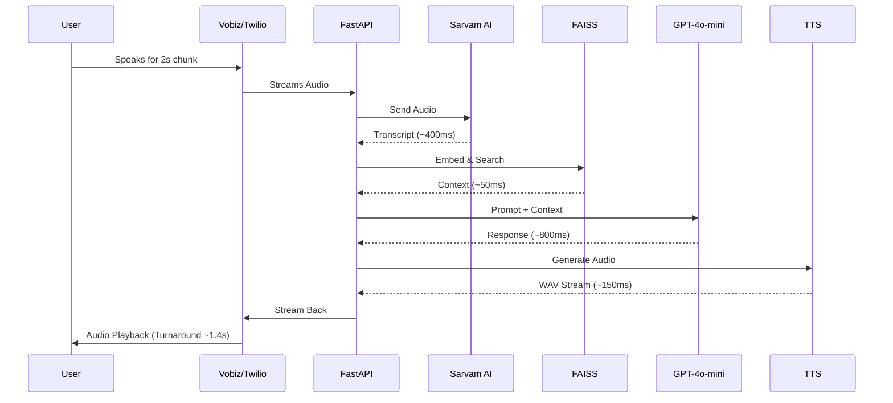

<div align="center">

# ⚡ GuniVox V5 (Sarvam AI STT + FAISS RAG Edition)

### Real Estate Business — Ultra-Low Latency AI Voice Assistant

[](https://python.org)
[](https://react.dev)
[](https://fastapi.tiangolo.com)
[](https://github.com/facebookresearch/faiss)
[](https://sarvam.ai)
[](https://openai.com)

**GuniVox V5** is the most advanced, performance-optimized version of the outbound voice assistant for **Real Estate Management**. It features a robust **FAISS RAG** system and is heavily optimized for ultra-low latency interactions using **Sarvam AI STT** and **TTS**.

---

[Technologies & Latency](#-technologies--latency-optimization) · [Features](#-features) · [Architecture](#-architecture) · [FAISS RAG Setup](#-faiss-rag-setup) · [Installation](#-installation--setup) · [Configuration](#%EF%B8%8F-configuration) 

</div>

---

## ⚡ Technologies & Latency Optimization

> ⏱️ **Total Agent Response Time:** From the moment the user finishes speaking, the AI agent processes the audio, searches the knowledge base, generates an intelligent response, and begins speaking back in **~1.2 to 1.5 seconds**.

GuniVox V5 was explicitly architected to achieve near-human conversation latency (Target: < 1.5 seconds Total Turnaround Time).

| Pipeline Stage | Technology Used | Purpose | Avg. Latency |
|---|---|---|---|
| **Speech-to-Text (STT)** | **Sarvam AI (`saaras:v3`)** | Converts user audio to text. Replaced legacy models to support real-time streaming and code-mixed Indian languages. Uses a strict **2-second audio chunking** via Vobiz XML to ensure rapid processing. | `~300 - 500 ms` |
| **Language Detection** | **Sarvam AI Auto-Detect** | Automatically detects whether the user speaks **English, Hindi, or Gujarati** and drops unsupported languages at the API level. | *(Included in STT)* |
| **Semantic RAG Search** | **FAISS + SentenceTransformers** | Uses local vector embeddings (`all-MiniLM-L6-v2`) to perform instantaneous similarity searches across `final_dataset.json`. Injects factual property data into the LLM context. | `< 50 ms` |
| **AI Logic (LLM)** | **OpenAI (`gpt-4o-mini`)** | The "brain" of GuniVox. Processes the STT transcript + RAG context and formulates a concise, conversational response. | `~600 - 900 ms` |
| **Text-to-Speech (TTS)** | **TTS** | Generates ultra-low latency voice audio. | `~100 - 150 ms` |
| **Telephony** | **Vobiz & Twilio** | Manages SIP routing and outbound calls to users. | `~100 ms (Network)` |

### 📉 Latency Breakdown (Visual)


*(The entire backend cycle takes roughly **1.2 to 1.5 seconds** from the moment the user stops speaking to the moment the bot starts replying.)*

---

## 🌟 Features

| Category | Feature |
|---|---|
| **🧠 FAISS RAG** | Advanced semantic search using FAISS vector index for property data |
| **🤖 AI Voice Agent** | Human-like AI counselor with warm, friendly tone |
| **📞 Outbound Dialer** | One-click outbound calls via Twilio/Vobiz API from the React dashboard |
| **🗣️ Multilingual** | Strict Auto-detection — **English (en-IN), Gujarati (gu-IN), Hindi (hi-IN)** |
| **⚡ Ultra-Low Latency** | Powered by Sarvam AI STT + TTS |
| **📊 Live Analytics** | Real-time call stats, positive lead tracking, and searchable call history |
| **📝 Live Transcription** | Real-time Speech-to-Text transcription displayed during active calls |
| **🏠 Property Management** | Full CRUD interface for managing real estate listings and prices |
| **📥 Excel Export** | One-click export of all call logs with transcripts to `.xlsx` |

---

## 🏛 Architecture

```
┌──────────────────────┐        ┌──────────────────────┐
│   React Frontend     │  HTTP  │   FastAPI Backend     │
│   (Vite + TS)        │◄──────►│   (Python)            │
│   Port: 3000         │        │   Port: 8000          │
└──────────────────────┘        └──────┬───────────────┘
                                       │
        ┌──────────────┬───────────────┼───────────────┬──────────────┐
        │              │               │               │              │
   ┌────▼────┐   ┌─────▼─────┐   ┌─────▼─────┐   ┌─────▼─────┐  ┌─────▼─────┐
   │ Vobiz / │   │ Sarvam AI │   │  OpenAI   │   │ FAISS     │  │ TTS       │
   │ Twilio  │   │ saaras:v3 │   │  GPT-4o-m │   │ Vector DB │  │           │
   └─────────┘   └───────────┘   └───────────┘   └───────────┘  └───────────┘
```

---

## 📦 Installation & Setup

### 1. Clone the Repository
```bash
git clone https://github.com/Dhruvil1308/GuniVox-V5-STT-Sarvam-with-RAG.git
cd GuniVox-V5-STT-Sarvam-with-RAG
```

### 2. Backend Setup (Python 3.10+)
```bash
python -m venv .venv
.venv\Scripts\activate
pip install -r requirements.txt
```

### 3. Frontend Setup (Node.js 18+)
```bash
npm install
```


### 5. Environment Variables (`.env.local`)
Create a `.env.local` file in the root directory:
```env
# AI Providers
OPENAI_API_KEY=sk-xxxxxxxxxxxxxxxxxxxxxxxxxxxxxxxxxxxxxxxx
SARVAM_API_KEY=sk_xxxxxxxxxxxxxxxxxxxxxxxx

# Telephony (Vobiz/Twilio)
VOBIZ_AUTH_ID=xxxxxxxxxxxxxxxxxxxxxxxxxxxxxxxx
VOBIZ_AUTH_TOKEN=xxxxxxxxxxxxxxxxxxxxxxxxxxxxxxxx
```

---

## 🟢 How to Run

### Windows Quick Start
Double click the `start_system.bat` file. This automatically:
1. Starts the FastAPI backend (`localhost:8000`)
2. Starts the Ngrok Tunnel for webhooks
3. Starts the React Dev Server (`localhost:3000`)

### Manual Start
**Terminal 1 (Backend):**
```bash
.venv\Scripts\activate
python server.py
```

**Terminal 2 (Frontend):**
```bash
npm run dev
```

---

## 📁 Project Structure

```
GuniVox_V3/
├── server.py               # FastAPI backend — Webhooks, LLM logic, Sarvam STT, TTS
├── faiss_rag.py            # FAISS vector database integration logic
├── prompt_config.py        # System prompt and conversational behavior logic
├── diagnostic_check.py     # Script to verify API keys and environment health
├── App.tsx                 # Main React Frontend App
├── src/                    # React components, services, and utilities
├── start_system.bat        # Windows launcher
└── requirements.txt        # Python dependencies (fastapi, requests, openai, faiss-cpu, etc.)
```

---
<div align="center">
  <p><strong>Built with ❤️ for Real Estate Management</strong></p>
  <p><sub>GuniVox V5 — Ultra-Low Latency Intelligent Voice Assistant</sub></p>
</div>